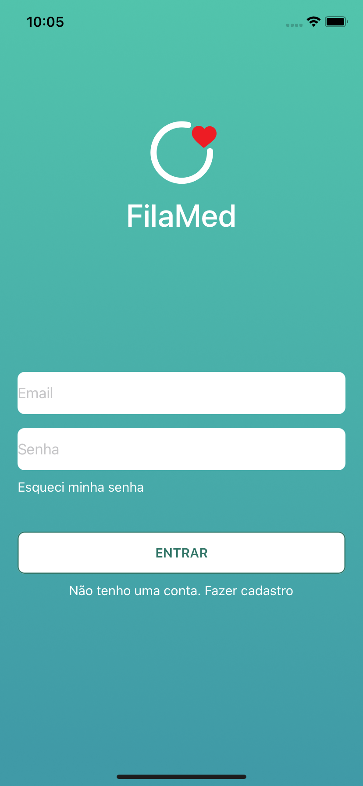
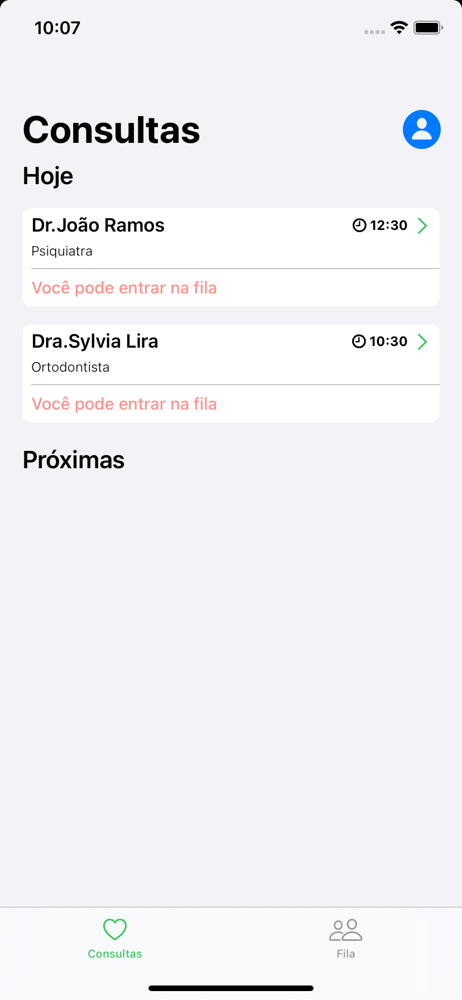

[![Contributors][contributors-shield]][contributors-url]
[![Commits][commits-shield]][commits-url]
[![Forks][forks-shield]][forks-url]
[![Stargazers][stars-shield]][stars-url]
[![Issues][issues-shield]][issues-url]

<!-- PROJECT LOGO -->
<br />
<p align="center">
  <a href="https://github.com/DaniloLira/FilaMed">
    
  </a>

  <h3 align="center">FilaMed</h3>

  <p align="center">
    O FilaMed é uma fila digital que gerencia atendimentos em consultórios de saúde. 
    <br />
    <a href="https://github.com/DaniloLira/FilaMed"><strong>Explore a documentação »</strong></a>
    <br />
    <br />
    <a href="https://github.com/DaniloLira/FilaMed">TestFlight</a>
    ·
    <a href="https://github.com/DaniloLira/FilaMed">Reporte Bug</a>
    ·
    <a href="https://github.com/DaniloLira/FilaMed">Solicite funcionalidades</a>
  </p>
</p>


<!-- TABLE OF CONTENTS -->
## Tabela de conteúdo

* [About the project](#about-the-project)
  * [Built With](#built-with)
* [Contributing](#git-flow)
  * [Add new feature or fix a bug](#add-new-feature-or-fix-a-bug)
  * [Pull Request Template](#pull-request-template)


<!-- ABOUT THE PROJECT -->
## About The Project
O FilaMed é um aplicativo iOS desenvolvido por estudantes da Apple Developer Academy (UFPE). Nosso objetivo com ele é facilitar o processo de fila em consultórios médicos visando evitar aglomerações e espera desnecessária. O aplicativo possui é uma fila digital que te avisa a melhor hora de sair de casa para chegar pontualmente no consultório, evitando atrasos e grande tempo de espera.

 



### Built With
Aqui listamos as tecnologias utilizadas para a construção deste projeto
* [Swift](https://swift.org/)
* [Firebase](https://firebase.google.com/?hl=pt-br)

<!-- Git Flow -->
## Git Flow

### Add new Feature or fix a Bug

1. Create your Feature or Fix Branch
  * `git checkout -b feature/AmazingFeature`
  * `git checkout -b fix/AmazingFix`
2. Commit your Changes
  * `git commit -m 'Feature(AmazingFeature): Add some AmazingFeature`
  * `git commit -m 'Fix(AmazingFix): Fixes a bug`
3. Push to the Branch
  * `git push origin feature/AmazingFeature`
  * `git push origin fix/AmazingFix`
4. Open a Pull Request in Github's Pull request tab and fill it with the above Pull Request Template.
5. If the Pull Request is not able to merge automatically do the following steps while on your branch:
```sh
git pull develop
```
6. Solves conflicts in Xcode, and commit your changes
7. Add reviewers to your Pull Request and wait for approval.

## Pull Request Template
```sh
### Issue Name
**What I did:**

- First thing I did...

- Second thing I did...

**How to test:**

- Brief notes on how to check if the feature works correctly.
```

<!-- MARKDOWN LINKS & IMAGES -->
<!-- https://www.markdownguide.org/basic-syntax/#reference-style-links -->
[contributors-shield]: https://img.shields.io/github/contributors/DaniloLira/FilaMed.svg?style=flat-square
[contributors-url]: https://img.shields.io/github/contributors/DaniloLira/FilaMed
[forks-shield]: https://img.shields.io/github/forks/DaniloLira/FilaMed.svg?style=flat-square
[forks-url]: https://img.shields.io/github/forks/DaniloLira/FilaMed
[commits-shield]: https://img.shields.io/github/last-commit/DaniloLira/FilaMed.svg?style=flat-square
[commits-url]: https://img.shields.io/github/last-commit/DaniloLira/FilaMed
[stars-shield]: https://img.shields.io/github/stars/DaniloLira/FilaMed.svg?style=flat-square
[stars-url]: https://img.shields.io/github/stars/DaniloLira/FilaMed
[issues-shield]: https://img.shields.io/github/issues/DaniloLira/FilaMed.svg?style=flat-square
[issues-url]: https://img.shields.io/github/issues/DaniloLira/FilaMed
[product-screenshot]: images/screenshot.png
